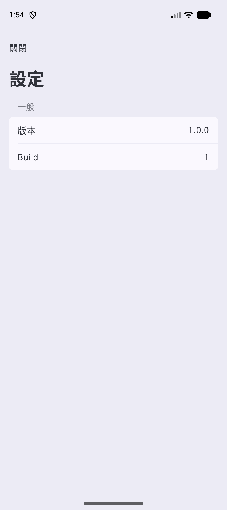
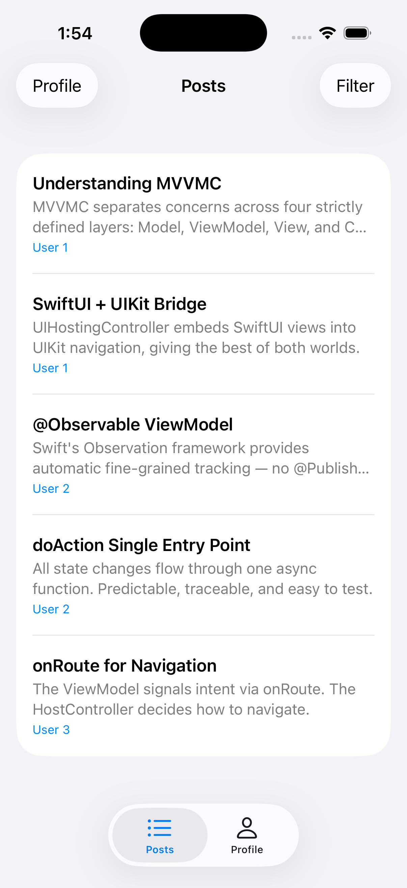

# 把 MVVMC 帶到 Android（二）：拿 Skip plugin 對著 codebase 開火

> Article A, Chapter 2。涵蓋 commit M8–M13（Steps 5–7d）。
> 重點：把 iOS app 跑起來、建好 Android shell、接上 `skipstone` plugin、跑完 transpile gauntlet、第一次在 Android 看到 MVVMC 畫面。
> 對應 Migration Log M8–M13。


---

## 零、上一篇結尾的承諾

Part 1 結束時我們有的東西：
- `Package.swift` 接好既有 `Sources/`
- Skip 套件 + `Skip.env` + `skip.yml` 都在位
- swift-tools 6.1 / Swift 6
- `Darwin/` shell 蓋好、第一個 `.app` bundle build 出來
- VM / View / Model **0 行改動**
- **`skipstone` plugin 沒接 target**——這是 Part 2 要做的事

Part 1 結尾留了一句話：「**下一篇要證明的事更難——MVVMC 的核心 pattern 跟 Skip 友善的 Swift 風格之間，到底差多遠**。」

這一篇就是去量這個距離。

---

## 一、iOS 真的能 launch（M8）

`Project.xcworkspace` 加在 repo 根目錄，裡面一個 `FileRef` 指向 `Darwin/MVVMCSkipDemo.xcodeproj`。`xcodeproj` 本身已經 reference 了 SPM package（`..`），所以 workspace 自動透過 xcodeproj 看到 `Package.swift`，不用另外加 reference。

然後：

```bash
xcrun simctl boot "iPhone 17"
open -a Simulator
skip app launch --ios --plain
# [✓] Check project schemes (0.74s)
# [✓] Build MVVMCSkipDemo App (1.33s)
# [✓] Install MVVMCSkipDemo.app (0.33s)
# [✓] Launch MVVMCSkipDemo (0.2s)
# [✓] Launch Skip app succeeded in 2.6s
```

2.6 秒，simulator 上跑出 MVVMC 的 PostList，Tab Bar 在底下，「Posts」「Profile」分頁正常。截圖證據在手——這是 **這個 repo 在 Skip-aware layout 下第一次「不只 build、而是 launch」**。

從 `UIApplicationMain` → `AppDelegate` → `SceneDelegate` → `UITabBarController` → `UINavigationController` → `PostListHostController` → `PostListView` 整條 UIKit lifecycle 鏈完整通——而且我們在 Part 1 用 Path A 換掉 entry 的決定，runtime 上確認沒副作用。iOS 行為跟 MVVMC baseline 一模一樣。

順便清掉了一個地雷：`.gitignore` 裡 `*.xcodeproj/project.pbxproj` 那行是 XcodeGen 時代的反射，現在這個專案的 `pbxproj` 是真的要 tracked。移掉。

---

## 二、Android shell 就位、預期失敗達成（M9）

`skip init` 在 `/tmp` 拿到的 Android scaffold 整個搬進 repo：`app/build.gradle.kts`、`AndroidManifest.xml`、`Main.kt`、`mipmap-*` 啟動圖示、`gradle-wrapper`、`settings.gradle.kts`。

但這個 commit 故意不讓 `skip app launch --android` 真的跑起來——`SKIP_ACTION` 仍然 `none`，原因 part 1 寫過：plugin 還沒接 target，所以沒有 transpile 出來的 Kotlin module 給 Android 用。

要證明 Android shell 真的就位，最誠實的測試是直接跑 gradle：

```
$ cd Android && gradle :app:assembleDebug
e: Could not locate transpiled module for MVVMCSkipDemo in 
   /Users/joe/Documents/github/MVVMC-Skip/Android/../.build/plugins/outputs.
   This may mean that the Skip project was not transpiled successfully.
```

**這就是原 Plan 預測「Step 7 開工的起點訊號」**。Android 端在等一個 Kotlin module 出現，但那個 module 還沒生出來——因為 plugin 還沒對著 SPM target 看一眼。

---

## 三、接 plugin，迎接「煙火秀」（M10）

`Package.swift` 一行：

```swift
plugins: [.plugin(name: "skipstone", package: "skip")]
```

掛到 `MVVMCSkipDemo` target + testTarget 上。預期心理是「Skip 對著整個 codebase 開火，錯誤洪流」——畢竟 part 1 的 M5 Journey 早就盤點過三類問題（Swift 6 concurrency、Kotlin constructor delegation、leading-dot enum），M5 把它叫做「avalanche」。

`xcodebuild` 跑下去，預期紅燈，紅燈來了：

```
** BUILD FAILED **
exit=65
```

但 `grep "error:" build.log | sort -u` 之後——

**只有一個 error**。

```
UserDetailHostController.swift:10:52: error: 
In Kotlin, delegating calls to 'self' or 'super' constructors can not use 
local variables other than the parameters passed to this constructor
```

`skipstone` 不是 avalanche，是 **fail-fast**——報第一個錯就停下，其他的根本沒去看。M5 的「煙火秀」預測**是錯的**。

但這個錯比我以為的好。它**讓 Skip 跟你一層一層剝洋蔥**：解掉這層，下一個錯出來，你再解。修一個 error 對應一個 commit、一個 Journey 節拍，敘事顆粒度精確。比「請從 50 個 errors 裡找關聯」舒服多了。

而且 M5 預測的「issue (2) — Kotlin constructor delegation」就是現在這個 error。M5 沒猜錯類別，只是猜錯了「出現方式」。

iOS 在這個 commit 是紅的——**全鏈唯一一個故意紅的 commit**，因為這個紅本身是文章的證據。

---

## 四、`#if !SKIP` 包住 UIKit，前線轉移（M11）

10 個檔案整檔包 `#if !SKIP` ... `#endif`：
- `AppDelegate` / `SceneDelegate` / `AppRouter` / `Deeplink`（App 層 4 個）
- 6 個 `*HostController.swift`（每個 feature 一個）

純機械貼上，沒動內部任何邏輯。理由很直接：這 10 個檔案有合理的 iOS-only 結構（UIKit class 繼承、`UIApplicationDelegate` conformance、`super.init(rootView:)` 引用 local var）——它們**根本不該被 transpile**，要對 Skip 隱形。`#if !SKIP` 是 Skip-canonical 的隱形方式。

再 build。HostController 系列錯誤消失。下一個 error 出來：

```
UserDetailView.swift:9:48: error: 
Kotlin does not support where conditions in case and catch matches. 
Consider using an if statement within the case or catch body
```

```swift
switch viewModel.state.api.fetchUser {
case .loading where viewModel.state.user == nil:
    ProgressView()
...
}
```

**這個 error 不在 VM 層。它在 View 層**。

M5 預測下一前線是「VM 層的 leading-dot enum」。結果 Skip 處理檔案時，alphabetical 順序碰到的是 View 層的 `case … where` pattern——Swift pattern matching 的 guard，Kotlin 沒對應語法。

這修改了我對 MVVMC × Skip 邊界的理解：**Skip 的 transpile gauntlet 不是只有一層**。
- C 層（HostController）有 constructor delegation 問題
- V 層（View）有 `case where` 問題
- VM 層（ViewModel）有 leading-dot enum + 巢狀 case destructuring 問題

每層都有自己的 Skip-incompatible Swift idiom。每個 idiom 都有一個小修法。

順便修正 M10 commit message 裡一個錯誤承諾：「7b restores green」——不對。Skip fail-fast 跨整個 module，前線往下走但 iOS xcodebuild 還是紅。要等整個 gauntlet 跑完才回綠。

---

## 五、跑 gauntlet（M12）

4 個 rebuild、4 個檔案修完，整個 module Skip-transpile clean。每一輪都是「rebuild → 看新 error → 修 → 再 rebuild」。

### Round 1 — `UserDetailView.swift`

`case .loading where user == nil:` → 把 guard 推進 case body：

```swift
case .loading:
    if let user = viewModel.state.user {
        UserInfoView(user: user)
    } else {
        ProgressView()
    }
```

語意完全等價——loading 狀態下有 user 就秀 user（背景刷新），沒 user 就秀 progress。Kotlin 友善。

### Round 2 — `UserDetailViewModel.swift`

兩種 pattern 同時出現，五個 error 位置：

**Pattern A — call site 巢狀 leading-dot enum**：

```swift
// 原寫法（Skip 認不出 .success 的 owning type）
await doAction(.apiResponse(.fetchUserDidFinish(.success(dto))))

// 改寫
let result: Result<UserDTO, APIError> = .success(dto)
await doAction(.apiResponse(.fetchUserDidFinish(result)))
```

把 `Result` 拉出來顯式宣告，Skip 就能推論型別。MVVMR-Skip 早就採用這個 idiom，可以照搬。

**Pattern B — switch case 巢狀 destructuring**：

```swift
// 原寫法（Kotlin 沒辦法在一個 case 裡解多層）
case let .fetchUserDidFinish(.success(dto)):
    state.user = dto.toDomain()
case let .fetchUserDidFinish(.failure(.message(msg))):
    state.api.fetchUser = .error(msg)

// 改寫
case let .fetchUserDidFinish(result):
    switch result {
    case let .success(dto):
        state.user = dto.toDomain()
    case let .failure(error):
        switch error {
        case let .message(msg):
            state.api.fetchUser = .error(msg)
        }
    }
```

外層 case 接收完整的 `Result`，內層 switch 拆。多寫幾行，但 iOS 行為一字不變。

### Round 3 — `PostListViewModel.swift`

跟 R2 一模一樣的兩種 pattern，因為兩個 VM 都遵守 MVVMC 的 `apiRequest` / `apiResponse` 標準形狀。複製貼上同樣的修法。

### Round 4 — `PostListView.swift`

兩個 error：
- Line 9: 同 `UserDetailView` 的 `case where` 改寫
- Line 62: `.contentShape(Rectangle())` — Skip 還沒實作這個 modifier，單行包 `#if !SKIP`：

```swift
.frame(maxWidth: .infinity, alignment: .leading)
#if !SKIP
.contentShape(Rectangle())
#endif
.onTapGesture { onTap() }
```

這個有趣：modifier chain 裡可以塞 `#if` 而不破壞語法（ViewBuilder context 接受）。Android 端少這個 modifier 不影響可點性——`onTapGesture` 在 SkipUI 也認。

### Round 5 — `** BUILD SUCCEEDED **`

整個 `MVVMCSkipDemo` module Skip-transpile 通過，62 個 Kotlin 檔產出在 `.build/.../mvvmc-skip.output/`，iOS xcodebuild 同時回綠（plugin task 成功 = 後續 Swift compile 不卡）。

### 意外的好消息

我以為 6 個 feature VM 每個都要修。實際上只修了 2 個（UserDetail、PostList）。另外 4 個（PostDetail、PostFilter、Profile、Settings）**零修通過**——它們的 state 沒有 `Result<X, APIError>` payload，Views 沒有 `case where`。**MVVMC 的 Skip-incompatible 表面積比 M5 害怕的小**。

`skip app launch --ios` 再跑一次，8.8 秒，simulator 上 app 完全正常——確認改寫沒副作用。

### MVVMC 架構在這個 checkpoint 上的判決

`doAction(.apiResponse(...))` 配巢狀 enum payload 是 MVVMC 唯一一個 Skip 不接受的 idiom。把 payload 拉到 typed `let`、case 拆內外兩層，**iOS 端 call shape 完全保留**、Android 端也認。

文章可以這樣寫：**MVVMC 的架構通過 Skip 的考驗，零變更；只有兩個侷限性的 Swift idiom 被改寫成等價但較囉嗦的形式**。

---

## 六、Android 第一次 render（M13）

「接 root view + flip `SKIP_ACTION` + 跑 launch」——原本計畫是三行。實際上**碰到第二道 gauntlet**。

### 接 root view

Main.kt 透過 typealias 引用兩個 Swift 符號：

```kotlin
private typealias AppRootView = MVVMCSkipDemoRootView
private typealias AppDelegate = MVVMCSkipDemoAppDelegate
```

這兩個型別 lib 裡沒有，要新建。設計約束：**iOS 不該看到**，因為 iOS root 是 SceneDelegate 設定的 UITabBarController；Android root 由 SwiftUI 重組。所以新檔 `Sources/MVVMCSkipDemo/Android/AppEntry.swift` 整檔包 `#if SKIP`：

```swift
#if SKIP
public struct MVVMCSkipDemoRootView: View {
  public init() {}
  public var body: some View {
    NavigationStack {
      SettingsView(viewModel: SettingsViewModel())
    }
  }
}

public final class MVVMCSkipDemoAppDelegate {
  public static let shared = MVVMCSkipDemoAppDelegate()
  private init() {}
  public func onInit() {}
  public func onLaunch() {}
  // … onResume / onPause / onStop / onDestroy / onLowMemory
}
#endif
```

第一輪渲染目標：就 `Settings`。其他 feature 之後 Step 8+ 再開。

### 第一道 wall：Android package mismatch

`gradle launchDebug` 立刻噴：

```
Could not find com.joe.mvvmc.demo:MVVMCSkipDemo:.
Required by: project ':app'
```

原因是 M5 時我把 `Skip.env` 的 `ANDROID_PACKAGE_NAME` 設成 `com.joe.mvvmc.demo`（iOS bundle id 同步），但 Skip 期待 `ANDROID_PACKAGE_NAME` 是 **Kotlin package 名**（`mvvmcskip.demo`），跟 iOS bundle id 是兩個概念。Main.kt 的 `package mvvmcskip.demo` 跟 Skip 預設一致，我的 env 變數對不齊。

修：`ANDROID_PACKAGE_NAME = mvvmcskip.demo`，另開 `ANDROID_APPLICATION_ID = com.joe.mvvmc.demo` 保留 app id 對齊 iOS。

### 第二道 wall：Kotlin compile gauntlet

修完 package，gradle 推進到 `compileDebugKotlin`——然後爆出**一整串新類別的錯**。

第一類：**`Unresolved reference 'ViewAction'`**。每個 View 裡的 `viewModel.doAction(.view(.something))` 都中。看 Skip 產出的 Kotlin：

```kotlin
viewModel.doAction(SettingsViewModel.Action.view(ViewAction.close))
//                                                ^^^^^^^^^^^ 沒有外層 qualifier
```

Skip 把外層 `.view` 正確解析成 `SettingsViewModel.Action.view`，**但內層 `.close` 變成裸 `ViewAction.close`**——丟掉了外層 class qualifier。Kotlin 找不到頂層 `ViewAction` 型別，所以解析失敗。

這是 Skip 轉譯器處理 extension 裡的 nested enum 時會犯的問題（class body 裡定義可能沒事，extension 裡會掉）。修法是**在 Swift 端顯式 qualify**：

```swift
// 從這個
Task { await viewModel.doAction(.view(.close)) }
// 改成這個
Task { await viewModel.doAction(.view(SettingsViewModel.ViewAction.close)) }
```

Skip 看到完整 `SettingsViewModel.ViewAction.close` 就會原樣輸出。

第二類：**`Unresolved reference 'ContentUnavailableView'`**。SkipUI 還沒實作這個 modifier/component。`UserDetailView` 跟 `PostListView` 都有用。要嘛包 `#if !SKIP` 給 iOS 用、Android 另寫替代品，要嘛把整個 View 暫時包 `#if !SKIP` 推到後續處理。

### 第三道 wall：Skip 的型別 silent fallback

`PostFilterViewModel+Models.swift`：

```swift
let users: [User] = (1...5).map { .init(id: $0) }
```

`.init(id: $0)` 是 leading-dot init，Swift compiler 從 `[User]` 推 `.init` 是 `User.init`。**Skip 推不出來**，silent fallback 到 Kotlin 的 `Any`：

```kotlin
internal val users: Array<User> = (1..5).map { it -> Any(id = it) }
//                                              ^^^^^^^^^^^^ Any 沒有 id 參數
```

修法跟 M12 的 leading-dot enum lift 同類——**顯式拼**：

```swift
let users: [User] = (1...5).map { User(id: $0) }
```

### 務實縮小範圍

M12 結束時太樂觀，以為「整個 tab-bar app 都能在 Android 跑」。M13 一打開 Kotlin compile gauntlet 才看清楚每個 feature 都有自己的 compile-stage 問題：Profile 用 `UIApplication.shared.open` 跟 `UNUserNotificationCenter`，UserDetail 跟 PostList 用 `ContentUnavailableView`，多處 `.view(.something)` 要顯式 qualify……每個都是獨立的 commit 量。

所以我把 Step 7d 收回到「**單一 feature 端到端跑 Android**」。其他五個 feature 暫時整檔包 `#if !SKIP`，Android 看不到，Step 8+ 一個一個處理。Settings 因為最單純（沒 API、沒 deeplink、一個 `.view(.close)` call site）成為第一個渲染目標。

三個 source 修正下去：

1. `Skip.env` 的 `ANDROID_PACKAGE_NAME`
2. `SettingsView` qualify `SettingsViewModel.ViewAction.close`
3. `PostFilterViewModel+Models` 的 `.init` 顯式

`skip app launch --android --plain` 跑：

```
[✓] Check project schemes (0.71s)
[✓] Build MVVMCSkipDemo App (14.0s)
[✓] Launch Skip app succeeded in 14.71s
```

Pixel 9 emulator 上：



**`關閉` 按鈕、`設定` 標題、`一般` section header、`版本 1.0.0`、`Build 1`**——Settings 完整渲染。Compose 接住了 SwiftUI 的 `List` / `LabeledContent` / `NavigationStack` / `toolbar`，中文字 rendering 對。

同時 iOS 沒被搞壞：



PostList tab + Tab Bar 維持 M8 之後完全不變的 UIKit 行為。

---

## 七、盤點：feature code 累計改了幾行？

| 檔案 | 改動 | 行數 | 性質 |
|---|---|---|---|
| `App/AppRouter.swift` | `nonisolated(unsafe)` | 1 | Swift 6 concurrency（M5） |
| `App/AppDelegate.swift` | 移 `@main` + public ×3 | ~5 | 跨 module 入口（M7） |
| `App/SceneDelegate.swift` | public ×6 | ~6 | 跨 module 入口（M7） |
| App-層 4 個檔 | `#if !SKIP` 整檔包 | ~8 | Skip 隱形（M11） |
| 6 個 `*HostController.swift` | `#if !SKIP` 整檔包 | ~12 | Skip 隱形（M11） |
| `UserDetailView.swift` | `case where` 改寫，後 `#if !SKIP` 包 | ~10 | M12 / M13 |
| `UserDetailViewModel.swift` | typed-let lift + 巢狀 case 拆 | ~15 | Skip 轉譯（M12） |
| `PostListViewModel.swift` | 同上 | ~15 | Skip 轉譯（M12） |
| `PostListView.swift` | `case where` + modifier `#if !SKIP` + 整檔包 | ~12 | M12 / M13 |
| `SettingsView.swift` | 顯式 qualify nested enum | ~3 | Kotlin compile（M13） |
| `PostFilterViewModel+Models.swift` | `.init` → `User(...)` | ~1 | Kotlin compile（M13） |
| 5 個其他 feature 檔（Profile / PostFilter / PostDetail） | `#if !SKIP` 包（Step 8 deferred） | ~10 | M13 |
| `Android/AppEntry.swift`（新建） | RootView + AppDelegate proxy | ~30 | Android 入口（M13） |

**累計約 130 行**遍佈約 23 個檔。

但**架構零變更承諾依然成立**：
- M / VM / V / C 四層分界 **未動**
- `doAction` 單一進入點 **未動**
- `Router` enum 機制 **未動**
- `@Observable` ViewModel 形狀 **未動**
- UIKit `HostController` 在 iOS 端的 C-層角色 **未動**

**Settings feature 從同一份 Swift source 在 iOS（UIKit 原生）跟 Android（Skip transpile 後的 Compose）都正確渲染**。這是 Article A 的核心承諾兌現的第一個證據點。

---

## 八、下一篇預告

Step 8（逐功能 Android port）和 Step 9（Router 接線）在 Part 3 展開。Runtime gauntlet 的根因、`.task` 取消問題、HostController 雙實作模式，都在那裡。

---

> 本文涵蓋的 commit：[`7558842`](../../../commit/7558842)（M8）、[`1ba78fa`](../../../commit/1ba78fa) + [`6e6dcb1`](../../../commit/6e6dcb1)（M9）、[`fa063a9`](../../../commit/fa063a9)（M10）、[`71b9284`](../../../commit/71b9284)（M11）、[`fdaaac1`](../../../commit/fdaaac1)（M12）、[`e4e934a`](../../../commit/e4e934a)（M13）
> 完整決策軌跡 + verification 在 [`../CLAUDE.md`](../CLAUDE.md) 的 Migration Log M8–M13。
